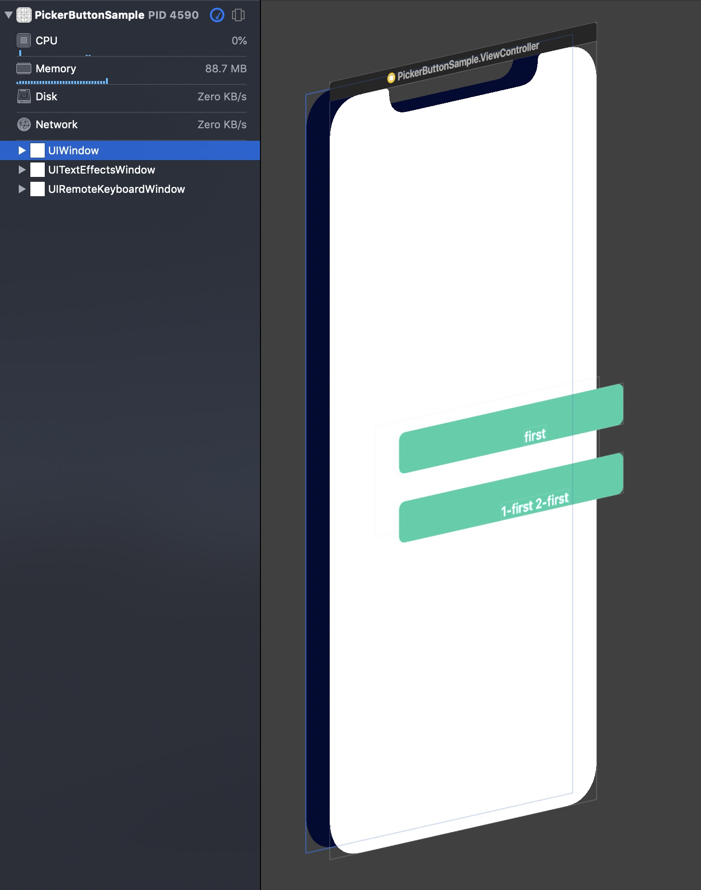
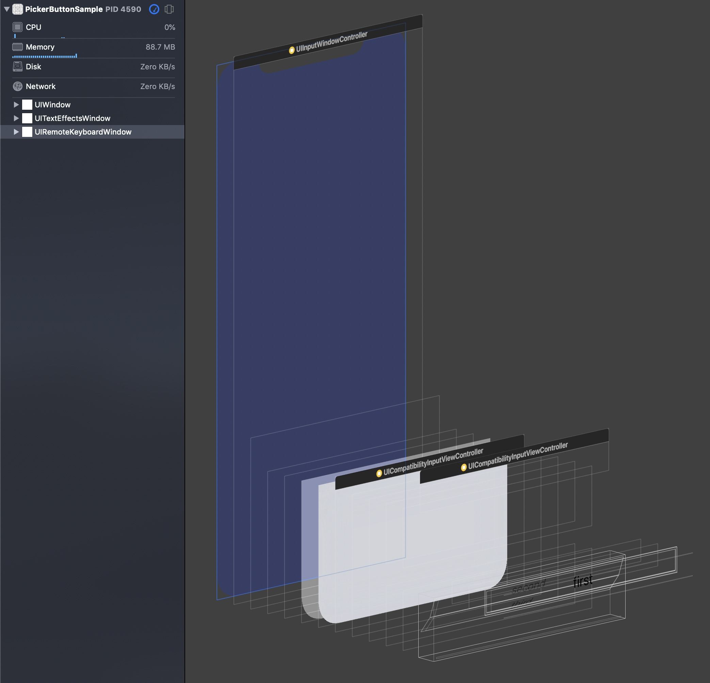
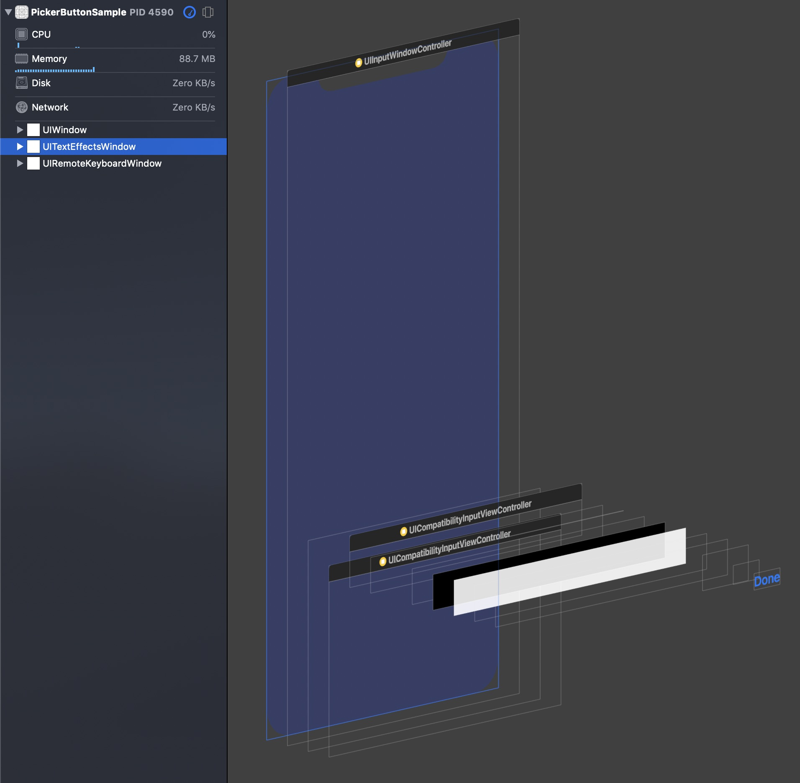
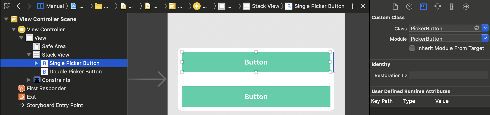

# PickerButton

[](https://developer.apple.com/iphone/index.action)
[](https://developer.apple.com/swift)
[](http://cocoapods.org/pods/PickerButton)
[](https://github.com/Carthage/Carthage)
[](http://cocoapods.org/pods/MisterFusion)

PickerButton is subclass of UIButton that presents UIPickerView in keyboard.


## Concept

When PickerButton is tapped, it presents UIPickerView on UIKeyboard.

| PickerButton | inputView | inputAccessoryView |
| :-: | :-: | :-: |
| PickerButton is in conformity to [UIKeyInput](https://developer.apple.com/documentation/uikit/uikeyinput). | PickerButton returns UIPickerView as [inputView](https://developer.apple.com/documentation/uikit/uiresponder/1621092-inputview). | PickerButton returns UIToolBar as [inputAccessoryView](https://developer.apple.com/documentation/uikit/uiresponder/1621119-inputaccessoryview). |
|  |  |  |


When selected row or component is changed, button title is automatically updated.


## Usage

PickerButton is almost same interface as UIPickerView.

```swift
class ViewController: UIViewController {

    @IBOutlet weak var button: PickerButton!

    let pickerValues: [String] = ["first", "second", "third"]

    override func viewDidLoad() {
        super.viewDidLoad()

        button.delegate = self
        button.dataSource = self
    }
}

extension ViewController: UIPickerViewDelegate, UIPickerViewDataSource {

    func pickerView(_ pickerView: UIPickerView, titleForRow row: Int, forComponent component: Int) -> String? {
        return pickerValues[row]
    }

    func numberOfComponents(in pickerView: UIPickerView) -> Int {
        return 1
    }

    func pickerView(_ pickerView: UIPickerView, numberOfRowsInComponent component: Int) -> Int {
        return pickerValues.count
    }
}
```

To use PickerButton in Storyboard / Xib, set Custom Class to `PickerButton`.



## Requirements

- Swift 4.2
- Xcode 10.1 or greater
- iOS 10.0 or greater

## Installation

#### CocoaPods

PickerButton is available through [CocoaPods](http://cocoapods.org). To install
it, simply add the following line to your Podfile:

```ruby
pod "PickerButton"
```

#### Carthage

If you’re using [Carthage](https://github.com/Carthage/Carthage), simply add
PickerButton to your `Cartfile`:

```
github "marty-suzuki/PickerButton"
```

Make sure to add `PickerButton.framework` to "Linked Frameworks and Libraries" and "copy-frameworks" Build Phases.

## Author

marty-suzuki, s1180183@gmail.com

## License

PickerButton is available under the MIT license. See the LICENSE file for more info.
